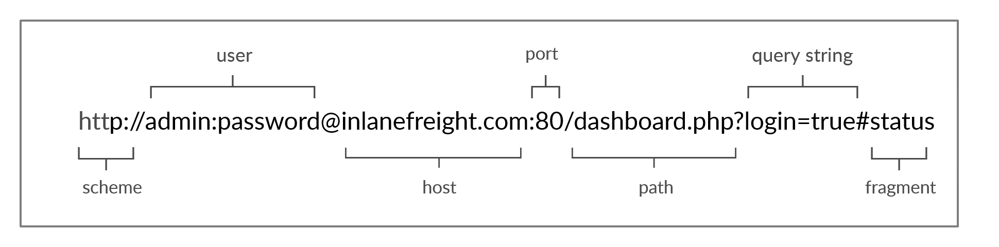

# HTTP Overview

## URL Structure

| **Component**   | **Description**   |
| --------------|-------------------|
| `Scheme`| This is used to identify the protocol being accessed by the client. This is usually http or https.|
| `User Info`| This is an optional component that contains credentials in the form username:password, which is used to authenticate to the host.|
| `Host`| The host signifies the resource location. This can be a hostname or an IP address. A colon separates a host and port. |
| `Port` |URLs without a port specified point to the default port 80. If the HTTP server port isn't running on port 80, it can be specified in the URL. |
| `Path` | This points to the resource being accessed, which can be a file or a folder. If there no path specified, the server returns the default index document hosted by it (for example, index.html). |
| `Query String` | The query string is preceded by a question mark (?). This is another optional component that is used to pass information to the resource. A query string consists of a parameter and a value. In the example above, the parameter is login, and its value is true. There can be multiple parameters separated by an ampersand (&).|

## Headers

| **Header**   | **Description**   |
| --------------|-------------------|
| **General Headers** |
| `Date`| The Date header holds the date and time at which the message originated. It's preferred to convert the time to the standard UTC time zone. |
| `Connection`| The Connection header dictates if the current network connection should stay alive after the request finishes. Two commonly used values for this header are close and keep-alive. The close value from either the client or server means that they would like to terminate the connection, while the keep-alive header indicates that the connection should remain open. |
| **Entity Headers** |
| `Content-Type`| This header is used to describe the type of resource being transferred. The value is automatically added by the browsers on the client-side and returned in the server response. |
| `Media-Type`| The media-type describes the data being passed. For example, the media-type for a PDF is application/pdf, while the type for a PNG image is image/png. This header can play a crucial role in making the server interpret our input. The charset field denotes the encoding standard, such as UTF-8. |
| `Boundary`| The boundary directive acts as a maker to separate content when there is more than one in the same message. |
| `Content-Length`| The Content-Length header holds the size of the entity being passed. This header is necessary as the server uses it to read data from the message body. |
| `Content-Encoding`| Data can undergo multiple transformations before being passed. For example, large amounts of data can be compressed to reduce the message size. The type of encoding being used should be specified using the Content-Encoding header. |
